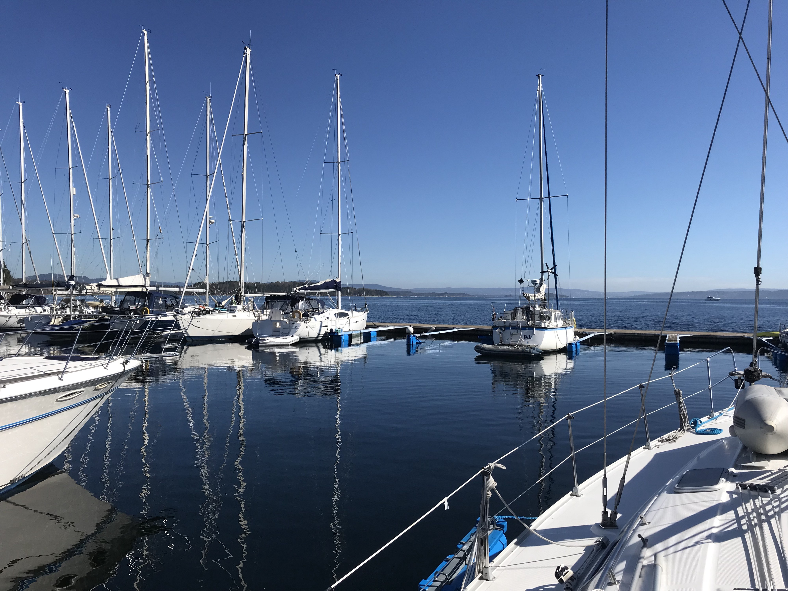
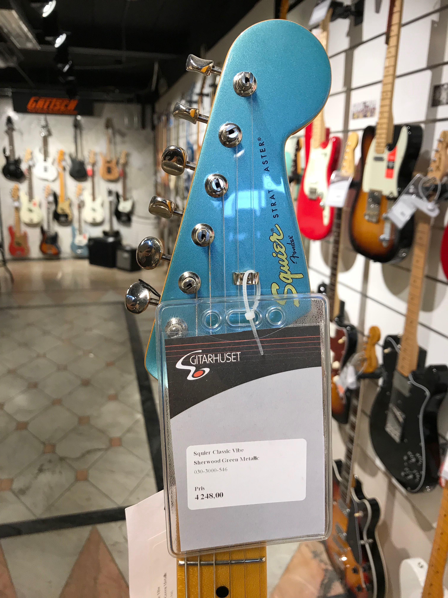

It was a sunny, calm day in Vollen, where I was spending summer this year. Vollen is a small Norwegian town in Asker area (not so far from Oslo). What I was doing there? For over a year I have lived on a boat. Normally, I’m trying to be in the center of Oslo (Aker Brygge Marina), but this year I ended up having my boat in Vollen Marina.

I was always dreaming to have a sailing boat and live on a boat. I ended up having one after some perturbations in my life, quite unexpectedly. It is 38 feet sloop — Bavaria 38.

So, I was sitting on boat and suddenly I got this feeling that I have to go and buy a guitar. For whole my life I was trying to learn to play a guitar. I had a few guitars in my live, a lot of hopes and usually not so much time (or determination?) to pursue my dream.

Normally, I would kill this feeling in my head and continue doing usual things (coding, fixing something on the boat or watching TV). But not this time…

It was exactly 5th of May. My boat and Vollen Marina that morning.

## Learn
Whole my life I had a chance to learn something from the people with more or different life experience than mine. Maybe because of that I was always into spending time with people slightly older than me.

From my friend and business partner Nikolai I learned that sometimes you should not plan too much. He has this “20% rule”, which is about spending ~20% of your life on a little bit random, unexpected things. Those kind of things which maybe from rational point of view don’t make sense. It is like planning to have an unexpected experience.

Buying guitar was not something obvious to do in my case. I already have some guitars I could bring to Norway, and what if again it is only going to collect dust and end up just making my boat heavier?

## Go for it
Having in mind the “20% rule” I decided to not think about it to much and go to Oslo and visit four different music stores. My plan was to choose one guitar in every shop, take a photo and choose one at the very end.

I was visiting shops one by one trying out guitars. In the last, biggest shop — 4sound at Grünerløkka, I was going around for a moment and then I noticed a guy who just entered the shop. He was talking on a phone. I noticed his native English and really deep “radio” voice. He was wearing black coat and a hat.

I told myself “ this has to be some artist or something” and I got back to checking guitars. I was standing next to Fender section when suddenly he was standing next to me asking “what kind of guitar you want to buy? Or maybe this is a wrong question.. which guitarist is your favorite one?”.

I answered “David Gilmour”. Then he started pointing out guitars saying “this one is no good, neither this one… that one is better and this one should be great”.

I commented it more like “mhmm” waving slightly with my head.

## Crisis of human interactions
A few months before I was introduced to Alek.
A former soldier with a few years of experience in the field. He saw in his life a lot.
He ended up living in Oslo, getting really interested in fixing
what we as a society fucked up completely — human interactions.

When he told me what he is doing and why, I told myself “wow… this problem is a foundation of so many problems we are facing as a society”.

Big part of his work is to take people seating in front of the screen and connect them in reality. That was very inspiring. Since then I was thinking about it a lot.

## Don’t kill it
Normally, I would try to escape from that situation, kill the small talk and pretend that I’m suddenly interested in Gibson’s and run to another part of the shop. A flashback from what we were discussing with Alek forced me to continue discussion with the stranger in the music store. I told myself “hey…this is a normal human situation, you should be able to have a few minutes of ordinary chat with anyone”.

I asked “So, what are you looking for? Are you also looking for a guitar?”.

We spent 40 minutes chatting about this and that. At the end we exchanged contact info. I bought a guitar (in the other shop) and came back to the boat. This is how I met David. Later I found out that he is a multi-instrumentalist, with huge experience in music industry and many productions on his account (including his own two albums).

Squire Classic Vibe — This is what I’ve chosen at the end.

## Coincidence
It is not that easy to meet new people when you are in your 30's, have a job whose bigger part is sitting with noise cancelling headphones in front of the computer screen. On top of that, Norway is not my homeland and my Norwegian is well… not really communicative.

After our meeting we hung out a few times having good time drinking wine and talking about whatever… it is always a pleasure David!

Somehow a Polish guy met an American guy in a music store in Oslo and they became friends. Pure coincidence, isn’t it?

P.S. I’m on the 5th level in Yousician (my username is: “mtheqk”, find me if you want). I’m still trying to catch my dream. Guess who promised me some lessons?