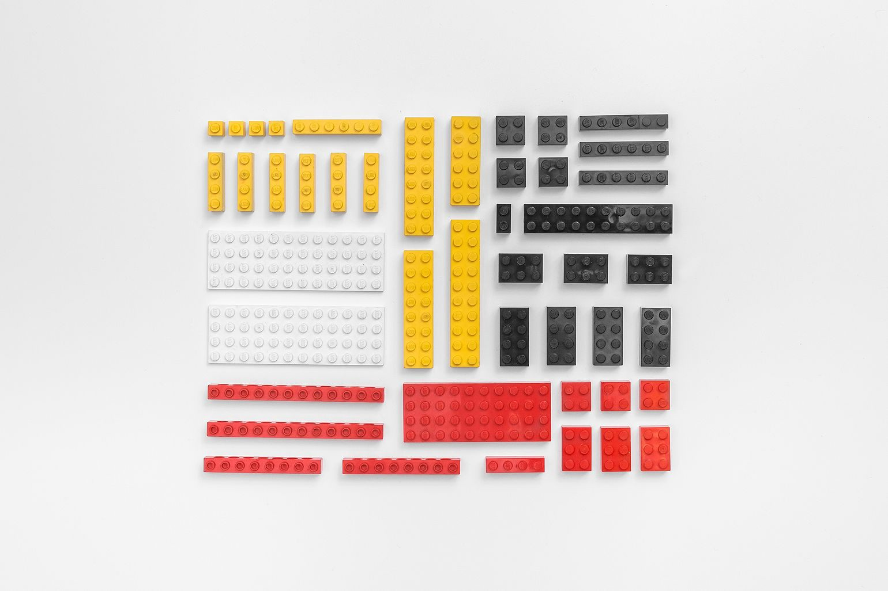

It is a hard question to answer, but I think everyone understands that we need to speed up. The world is full of problems, and we need to be faster in finding solutions. Is the way we are working these days optimal? What can we do to be more efficient?

## Passion or obsession?
During my childhood, I was very intense about building from Lego bricks. I was creating new constructions or rebuilding previous concepts.

Photo by Michał Kulesza

Many hours in silence, without drinks, without food, without a break. Over and over again. My mum had to check on me because she was not sure if I’m at home. It was a while ago. But that passion — or one can say — obsession is still present deep inside me.

## The necessity of building
When I’m looking at things, I usually feel disappointed. I don’t know precisely why it is like that, but I think I kind of understand this mechanism. Have you ever had this feeling that thing is too complex or that we already have a tech which can solve it at least ten times better?

I feel the desire to work on problems I care about and unfortunately for me — I’m quite often jumping on different things almost right away. This creates a mess in my private and professional life: dozens of unfinished projects, lonely nights working, tones of money spent in the process. I often feel like a complete loser. Is it even worth it?

## Can’t stop
When a few years ago I hit the wall in my previous workplace I decided to slow down, not be so intense in my work and side projects. As you suspect I ended up elsewhere. Why?

Because I truly like thinking and working on problems. That makes me happy, but it is also very demanding. And I have to accept it.

## My life mission
Last few years of my life is about that. I’m involved in Flow Platform, EYEDEA, Picoblocks, Newmark, Explorer HQ, and HACKLAG. All those things are touching the same topic from different angles.

Which tools to use? How to get the best people? When to start with analytics? Kanban, Scrum or maybe something completely different? How to conduct tests? How to build things faster?

This is all about digital products development process — and how to improve it. This is what I want to work on. This is my life mission.
